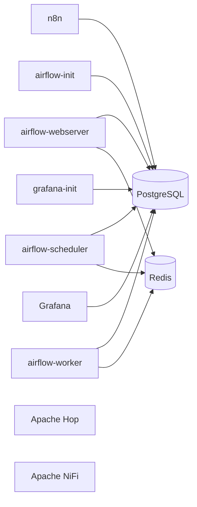

# docker-services

Stack Docker Compose para levantar un laboratorio de automatización, orquestación y observabilidad de datos con PostgreSQL como backend compartido.

## Qué problema resuelve

Este repositorio resuelve tres problemas comunes en equipos de datos e integración:

1. Provisionar rápido un entorno completo de herramientas de automatización sin instalar cada plataforma manualmente.
2. Estandarizar el arranque de servicios que comparten base de datos, red y convenciones operativas.
3. Reducir fricción entre desarrollo, pruebas técnicas y demostraciones funcionales.

## Ámbitos de aplicación

- Integración de datos y ETL/ELT.
- Automatización de procesos y workflows empresariales.
- Orquestación de pipelines por calendario y eventos.
- Observabilidad operativa y visualización de métricas.
- Entornos de formación, PoC y preproducción técnica.

## Casos de uso

- Automatizar integraciones entre APIs, bases de datos y sistemas internos con n8n.
- Ejecutar DAGs de ingestión y transformación en Airflow con Celery.
- Diseñar pipelines visuales de datos en Apache Hop.
- Diseñar y operar flujos de streaming/eventos en Apache NiFi.
- Centralizar dashboards operativos y de negocio en Grafana.
- Reutilizar PostgreSQL como datastore compartido para metadatos y configuración.

## Servicios incluidos

- PostgreSQL: base de datos compartida para n8n, Airflow y Grafana.
- n8n: automatización low-code/no-code de flujos de trabajo.
- Apache Airflow + Redis: orquestación de DAGs con CeleryExecutor.
- Apache Hop: diseño y ejecución de pipelines de datos.
- Apache NiFi: gestión de flujo de datos y enrutamiento.
- Grafana: visualización y monitoreo.
- Node-RED: automatización de flujos IoT e integración visual.
- MySQL: base de datos relacional opcional para aplicaciones.
- Cassandra: base NoSQL distribuida opcional para alta escritura.
- Portainer: administración visual del ciclo operativo de contenedores.
- Portainer Agent: endpoint remoto opcional para administrar otros hosts Docker desde Portainer.

## Arquitectura lógica



## Requisitos

- Docker Engine 24+.
- Docker Compose Plugin 2.20+.
- Red Docker externa `red-principal`.

Creación de red:

```sh
docker network create red-principal
```

Bootstrap inicial de volúmenes persistentes:

Estos volúmenes se declaran como externos para que el redeploy de contenedores no intente recrearlos ni reclamar su ciclo de vida.
En un host nuevo, crea solo los volúmenes del servicio que vayas a desplegar.

```sh
docker volume create postgresql_postgres_data_latest
docker volume create portainer_portainer_data

docker volume create airflow_airflow_logs
docker volume create airflow_airflow_dags
docker volume create airflow_airflow_plugins
docker volume create airflow_redis_data

docker volume create n8n_n8n_storage
docker volume create grafana_grafana_data

docker volume create apache-nifi_nifi_conf
docker volume create apache-nifi_nifi_state
docker volume create apache-nifi_nifi_content
docker volume create apache-nifi_nifi_provenance
docker volume create apache-nifi_nifi_database
docker volume create apache-nifi_nifi_python
docker volume create apache-nifi_nifi_flowfile
docker volume create apache-nifi_nifi_nar
docker volume create apache-nifi_nifi_logs

docker volume create nodered_nodered_data
docker volume create mysql_mysql_data
docker volume create cassandra_cassandra_data
```

## Alcance del repositorio

Este repositorio se limita a:

1. Definición de archivos YAML/Compose por servicio.
2. Definición de archivos de entorno por servicio en `env/*.env`.
3. Documentación de despliegue y validación técnica.

El encendido y apagado operativo de contenedores se realiza manualmente desde Portainer, según necesidad del usuario.

## Inicio rápido

1. Clonar repositorio.
2. Crear red Docker externa.
3. Levantar PostgreSQL.
4. Levantar servicios que dependen de PostgreSQL según necesidad.

```sh
git clone https://github.com/lraigosov/docker-services.git
cd docker-services
docker network create red-principal
docker compose -f compose/postgresql-service.yaml up -d
docker compose -f compose/portainer-service.yaml up -d
docker compose -f compose/n8n-service.yaml --env-file env/n8n-service.env up -d
docker compose -f compose/airflow-service.yaml --env-file env/airflow-service.env up -d
docker compose -f compose/grafana-service.yaml --env-file env/grafana-service.env up -d
docker compose -f compose/apache-hop-service.yaml up -d
docker compose -f compose/apache-nifi.service.yaml up -d
docker compose -f compose/nodered-service.yaml --env-file env/nodered-service.env up -d
docker compose -f compose/mysql-service.yaml --env-file env/mysql-service.env up -d
docker compose -f compose/cassandra-service.yaml --env-file env/cassandra-service.env up -d
```

## Operación desde Portainer

- El ciclo de encendido/apagado diario se gestiona desde Portainer.
- Los comandos Docker Compose de este README se usan para despliegue inicial, recreación o validación técnica.
- Mantener PostgreSQL como servicio compartido cuando otros servicios lo requieran.

## Redeploy seguro sin afectar volúmenes

Todos los archivos Compose quedaron normalizados con un `name:` propio por servicio para evitar avisos de `orphan containers` entre stacks distintos.

Además, los volúmenes persistentes fueron fijados con `name:` explícito en formato `proyecto_volumen`, apuntando a la persistencia ya existente, de forma que el redeploy de contenedores no cree volúmenes nuevos ni pierda datos previos.

Los contenedores `n8n-init` y `grafana-init` quedaron con `tmpfs` en la ruta interna de PostgreSQL para evitar volúmenes anónimos de la imagen base.

Reglas operativas:

1. Usar `pull` y `up -d --no-deps --force-recreate` solo sobre los contenedores de aplicación.
2. No usar `down -v`, `rm -v` ni `docker volume rm` si quieres conservar datos.
3. Los contenedores `*-init` quedan fuera del redeploy rutinario; solo deben ejecutarse cuando necesites reprovisionar bootstrap o migraciones.
4. Después de esta normalización, la primera recreación de un stack antiguo puede requerir eliminar solo sus contenedores previos para que adopten el nuevo nombre de proyecto, sin tocar volúmenes.

Patrón general:

```sh
docker compose -f compose/SERVICIO.yaml pull APP_SERVICE
docker compose -f compose/SERVICIO.yaml up -d --no-deps --force-recreate APP_SERVICE
```

Stacks con archivo `.env`:

```sh
docker compose -f compose/SERVICIO.yaml --env-file env/SERVICIO.env pull APP_SERVICE
docker compose -f compose/SERVICIO.yaml --env-file env/SERVICIO.env up -d --no-deps --force-recreate APP_SERVICE
```

Ejemplos por servicio:

```sh
docker compose -f compose/portainer-service.yaml pull portainer
docker compose -f compose/portainer-service.yaml up -d --no-deps --force-recreate portainer

docker compose -f compose/postgresql-service.yaml pull postgres
docker compose -f compose/postgresql-service.yaml up -d --no-deps --force-recreate postgres

docker compose -f compose/n8n-service.yaml --env-file env/n8n-service.env pull n8n-server
docker compose -f compose/n8n-service.yaml --env-file env/n8n-service.env up -d --no-deps --force-recreate n8n-server

docker compose -f compose/airflow-service.yaml --env-file env/airflow-service.env pull airflow-webserver airflow-scheduler airflow-worker
docker compose -f compose/airflow-service.yaml --env-file env/airflow-service.env up -d --no-deps --force-recreate airflow-webserver airflow-scheduler airflow-worker

docker compose -f compose/grafana-service.yaml --env-file env/grafana-service.env pull grafana-server
docker compose -f compose/grafana-service.yaml --env-file env/grafana-service.env up -d --no-deps --force-recreate grafana-server

docker compose -f compose/apache-hop-service.yaml pull hop-server hop-web
docker compose -f compose/apache-hop-service.yaml up -d --no-deps --force-recreate hop-server hop-web

docker compose -f compose/apache-nifi.service.yaml pull nifi
docker compose -f compose/apache-nifi.service.yaml up -d --no-deps --force-recreate nifi

docker compose -f compose/nodered-service.yaml --env-file env/nodered-service.env pull nodered
docker compose -f compose/nodered-service.yaml --env-file env/nodered-service.env up -d --no-deps --force-recreate nodered

docker compose -f compose/mysql-service.yaml --env-file env/mysql-service.env pull mysql
docker compose -f compose/mysql-service.yaml --env-file env/mysql-service.env up -d --no-deps --force-recreate mysql

docker compose -f compose/cassandra-service.yaml --env-file env/cassandra-service.env pull cassandra
docker compose -f compose/cassandra-service.yaml --env-file env/cassandra-service.env up -d --no-deps --force-recreate cassandra
```

Migración única desde stacks creados antes de esta normalización:

```sh
docker rm -f n8n_init n8n-server
docker compose -f compose/n8n-service.yaml --env-file env/n8n-service.env up -d
```

La misma lógica aplica a cada stack: elimina solo sus contenedores antiguos y vuelve a levantar el archivo Compose correspondiente. Los volúmenes persistentes no se tocan.

En una instalación heredada, la migración correcta consta de dos pasos:

1. Copiar el contenido del volumen legado al nuevo volumen con prefijo de proyecto.
2. Eliminar solo los contenedores antiguos y recrearlos con el Compose normalizado.

Después de validar el arranque con el nuevo volumen, ya puedes eliminar el volumen legado original.

Comandos de migración inicial por stack:

```sh
docker rm -f postgres_server
docker compose -f compose/postgresql-service.yaml up -d

docker rm -f redis_server airflow_init airflow_apiserver airflow_scheduler airflow_worker
docker compose -f compose/airflow-service.yaml --env-file env/airflow-service.env up -d

docker rm -f n8n_init n8n-server
docker compose -f compose/n8n-service.yaml --env-file env/n8n-service.env up -d

docker rm -f grafana_init grafana-server
docker compose -f compose/grafana-service.yaml --env-file env/grafana-service.env up -d

docker rm -f hop-init hop-server hop-web
docker compose -f compose/apache-hop-service.yaml up -d

docker rm -f nifi
docker compose -f compose/apache-nifi.service.yaml up -d

docker rm -f nodered
docker compose -f compose/nodered-service.yaml --env-file env/nodered-service.env up -d

docker rm -f mysql-server
docker compose -f compose/mysql-service.yaml --env-file env/mysql-service.env up -d

docker rm -f cassandra-server
docker compose -f compose/cassandra-service.yaml --env-file env/cassandra-service.env up -d
```

Estos comandos eliminan únicamente contenedores. Los volúmenes persistentes siguen intactos porque quedaron fijados con nombres explícitos.

## Backup y restore de Portainer

El estado funcional de Portainer queda persistido en el volumen `portainer_portainer_data`. Para respaldarlo o restaurarlo no hace falta exportar el contenedor, solo ese volumen.

La carpeta local recomendada es `backups/portainer/`. Tanto la carpeta `backups` como todo su contenido quedan ignorados por Git.

Backup del volumen:

```sh
mkdir -p backups/portainer
docker run --rm \
  -v portainer_portainer_data:/data \
  -v "${PWD}/backups/portainer:/backup" \
  alpine:3.20 \
  sh -c 'cd /data && tar czf /backup/portainer_data_$(date +%F_%H%M%S).tar.gz .'
```

Restore del volumen:

```sh
export PORTAINER_RESTORE_FILE=portainer_data_YYYY-MM-DD_HHMMSS.tar.gz
test -f "backups/portainer/${PORTAINER_RESTORE_FILE}"

docker compose -f compose/portainer-service.yaml stop portainer

# Backup preventivo del estado actual antes de sobrescribir
docker run --rm \
  -v portainer_portainer_data:/data \
  -v "${PWD}/backups/portainer:/backup" \
  alpine:3.20 \
  sh -c 'cd /data && tar czf /backup/pre_restore_$(date +%F_%H%M%S).tar.gz .'

docker run --rm \
  -e PORTAINER_RESTORE_FILE="${PORTAINER_RESTORE_FILE}" \
  -v portainer_portainer_data:/data \
  -v "${PWD}/backups/portainer:/backup" \
  alpine:3.20 \
  sh -c 'rm -rf /data/* /data/.[!.]* /data/..?* 2>/dev/null || true; tar xzf "/backup/${PORTAINER_RESTORE_FILE}" -C /data'

docker compose -f compose/portainer-service.yaml up -d portainer
curl -k https://localhost:9443
```

Buenas prácticas para restore:

1. Restaurar sobre una versión igual o compatible de Portainer CE.
2. Detener el contenedor antes de escribir en el volumen.
3. Tomar un backup preventivo del volumen actual antes de sobrescribirlo.
4. Validar que la UI responda después del restore.

## Portainer Agent para endpoints remotos

El archivo `compose/portainer-agent-service.yaml` está pensado para desplegarse en un host Docker remoto que será administrado desde Portainer.

Despliegue en el host remoto:

```sh
docker compose -f compose/portainer-agent-service.yaml up -d
```

Redeploy seguro del agente:

```sh
docker compose -f compose/portainer-agent-service.yaml pull portainer-agent
docker compose -f compose/portainer-agent-service.yaml up -d --no-deps --force-recreate portainer-agent
```

Alta del endpoint en Portainer:

1. Crear entorno de tipo Docker Standalone.
2. Elegir método Agent.
3. Registrar el endpoint como `tcp://HOST_REMOTO:9001`.

## Acceso por servicio

| Servicio | URL/Host | Puerto | Notas |
|---|---|---|---|
| n8n | http://localhost:5678 | 5678 | Requiere PostgreSQL |
| PostgreSQL | localhost | 5432 | TCP |
| Airflow API/UI | http://localhost:8080 | 8080 (configurable) | Requiere PostgreSQL y Redis |
| Apache Hop Web | http://localhost:8081 | 8081 (configurable) | Puerto por defecto para evitar conflicto con Airflow |
| Apache Hop Server | http://localhost:8181 | 8181 | API/Server de Hop |
| Apache NiFi | https://localhost:8443/nifi | 8443 | HTTPS |
| Grafana | http://localhost:3000 | 3000 | Requiere PostgreSQL |
| Node-RED | http://localhost:1880 | 1880 | Servicio opcional |
| MySQL | localhost | 3306 | TCP, servicio opcional |
| Cassandra | localhost | 9042 | CQL/TCP, servicio opcional |
| Portainer | https://localhost:9443 | 9443 (UI) / 8000 (Edge) | Gestión operativa de contenedores |

## Variables de entorno

### env/airflow-service.env

Variables mínimas necesarias:

```env
POSTGRES_USER=postgres
POSTGRES_PASSWORD=postgrespw
POSTGRES_HOST=postgres_server
REDIS_PASSWORD=redis_change_me
AIRFLOW_UID=5000
AIRFLOW_GID=5000
AIRFLOW_FERNET_KEY=your_fernet_key_here
AIRFLOW_VERSION=latest
```

Opcional para puerto expuesto del webserver:

```env
AIRFLOW_PORT=8080
```

### Puerto configurable de Hop Web

`compose/apache-hop-service.yaml` usa por defecto `8081:8080` para evitar choque con Airflow.
Puedes sobrescribirlo al levantar:

```sh
HOP_WEB_PORT=8081 docker compose -f compose/apache-hop-service.yaml up -d
```

### env/grafana-service.env

```env
GRAFANA_PG_DATABASE=grafana
GRAFANA_PG_USER=postgres
GRAFANA_PG_PASSWORD=postgrespw
GRAFANA_PG_HOST=postgres_server
GRAFANA_PG_PORT=5432
GRAFANA_ADMIN_USER=admin
GRAFANA_ADMIN_PASSWORD=admin123
```

### env/n8n-service.env

```env
POSTGRES_DB=n8n
POSTGRES_PASSWORD=postgrespw
POSTGRES_USER=postgres
POSTGRES_HOST=postgres_server
```

### env/nodered-service.env

```env
NODERED_PORT=1880
NODERED_TZ=America/Bogota
```

### env/mysql-service.env

```env
MYSQL_PORT=3306
MYSQL_ROOT_PASSWORD=mysqlrootpw
MYSQL_DATABASE=app_db
MYSQL_USER=app_user
MYSQL_PASSWORD=app_user_pw
MYSQL_TZ=America/Bogota
```

### env/cassandra-service.env

```env
CASSANDRA_PORT=9042
CASSANDRA_CLUSTER_NAME=docker-services-cluster
CASSANDRA_DC=dc1
CASSANDRA_RACK=rack1
CASSANDRA_MAX_HEAP_SIZE=512M
CASSANDRA_HEAP_NEWSIZE=100M
```

## Mejoras y optimizaciones aplicadas

1. Se definió una plantilla recomendada para variables de Airflow (sin aplicarla automáticamente).
2. Se corrigieron variables de Grafana para conexión PostgreSQL (`GRAFANA_PG_PASSWORD` y puerto).
3. Se consolidó instalación de plugins de Grafana en una única variable para evitar sobrescritura.
4. Se retiró configuración insegura `POSTGRES_HOST_AUTH_METHOD=trust` en PostgreSQL.
5. Se agregó `healthcheck` en PostgreSQL para mejorar observabilidad operativa.
6. Se corrigió inconsistencia de puerto documentado en NiFi.
7. Se normalizó `name:` en todos los archivos Compose para evitar avisos de `orphan containers` entre stacks distintos.
8. Se fijaron nombres explícitos de volúmenes persistentes para permitir redeploy sin pérdida de datos existentes.

## Recomendaciones operativas

1. Sustituir imágenes `latest` por versiones fijas para entornos productivos.
2. Rotar contraseñas por defecto y mover secretos a un gestor seguro.
3. Separar puertos o perfiles para ejecutar Airflow y Hop simultáneamente sin conflicto.
4. Implementar backups periódicos del volumen de PostgreSQL.
5. Versionar dashboards/provisioning de Grafana en carpeta dedicada.

## Validación de configuración

Comprobar sintaxis de Compose antes de levantar:

```sh
docker compose -f compose/postgresql-service.yaml config
docker compose -f compose/portainer-service.yaml config
docker compose -f compose/portainer-agent-service.yaml config
docker compose -f compose/n8n-service.yaml --env-file env/n8n-service.env config
docker compose -f compose/airflow-service.yaml --env-file env/airflow-service.env config
docker compose -f compose/grafana-service.yaml --env-file env/grafana-service.env config
docker compose -f compose/apache-hop-service.yaml config
docker compose -f compose/apache-nifi.service.yaml config
docker compose -f compose/nodered-service.yaml --env-file env/nodered-service.env config
docker compose -f compose/mysql-service.yaml --env-file env/mysql-service.env config
docker compose -f compose/cassandra-service.yaml --env-file env/cassandra-service.env config
```

## WSL (Ubuntu-24.04)

Si validas desde WSL, usar exclusivamente la distro `Ubuntu-24.04`:

```sh
wsl -d Ubuntu-24.04
cd /mnt/f/GitHub/docker-services
docker compose -f compose/postgresql-service.yaml config
```

## Estructura

```text
docker-services/
├── compose/
│   ├── airflow-service.yaml
│   ├── apache-hop-service.yaml
│   ├── apache-nifi.service.yaml
│   ├── cassandra-service.yaml
│   ├── grafana-service.yaml
│   ├── mysql-service.yaml
│   ├── n8n-service.yaml
│   ├── nodered-service.yaml
│   ├── portainer-agent-service.yaml
│   ├── portainer-service.yaml
│   └── postgresql-service.yaml
├── env/
│   ├── airflow-service.env
│   ├── cassandra-service.env
│   ├── grafana-service.env
│   ├── mysql-service.env
│   ├── n8n-service.env
│   └── nodered-service.env
├── config/
├── container-audit-ubuntu-24.04.md
├── devlog.md
├── estructura.txt
└── README.md
```

## Licencia

MIT